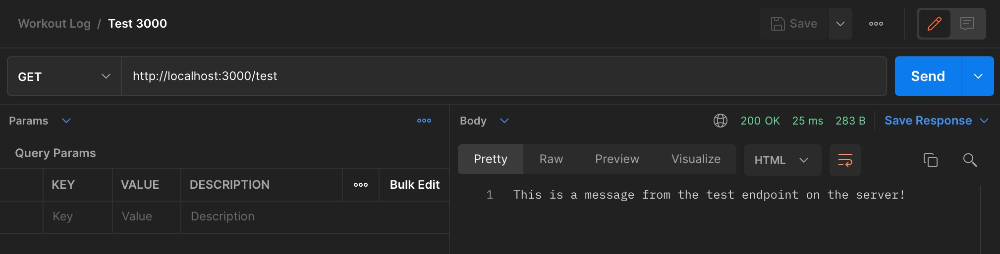
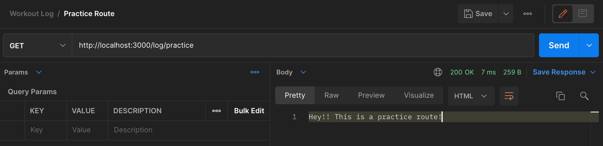
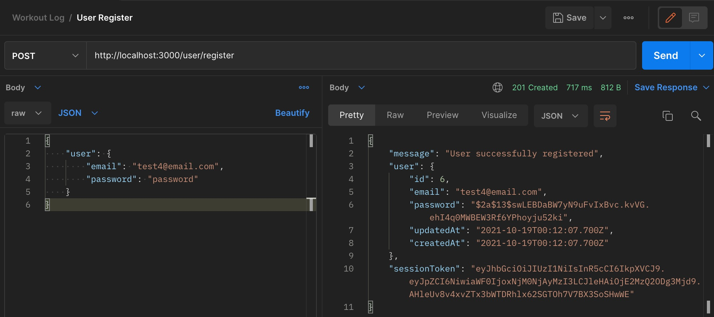
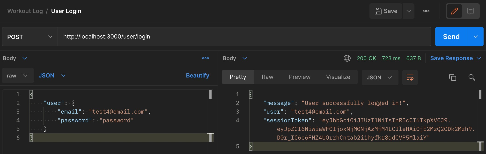
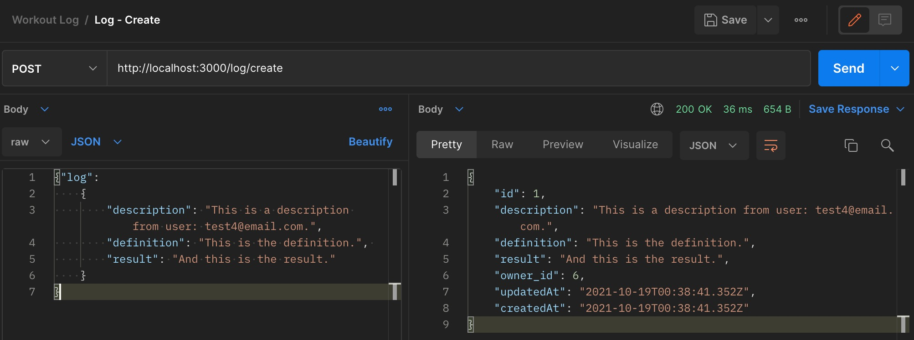
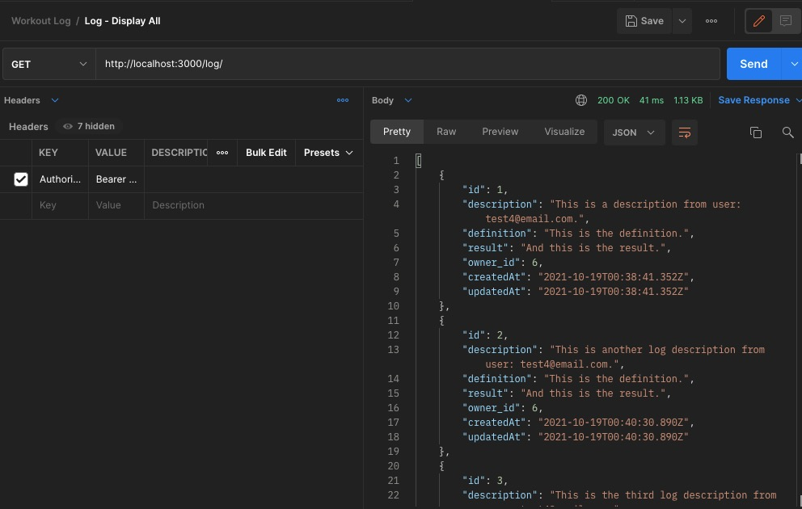
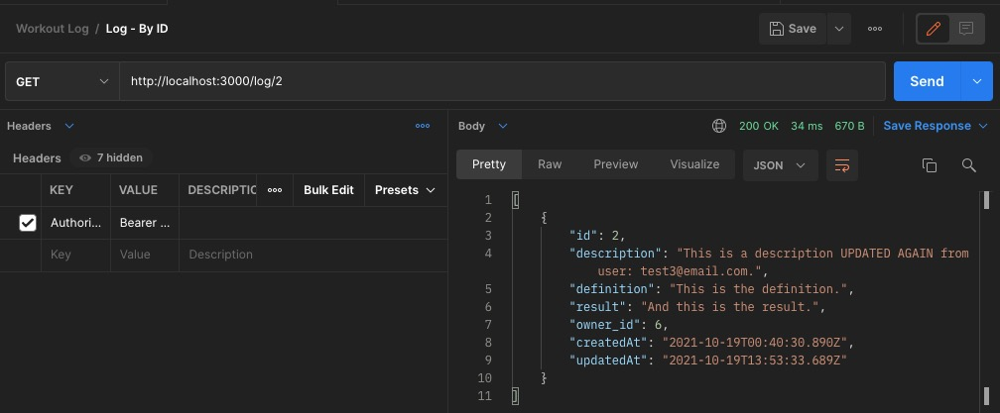
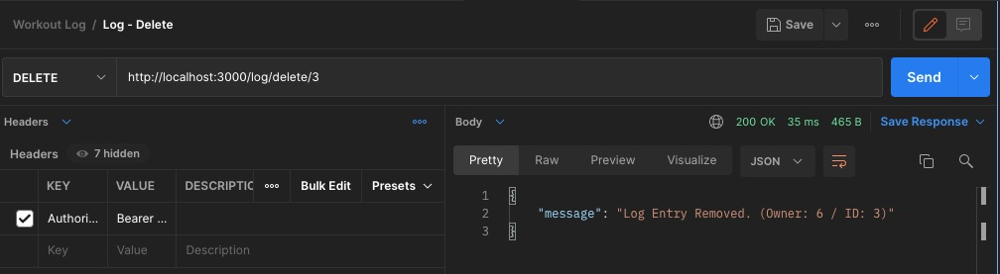

Testing endpoints in Postman

/test

/log/practice

-------------------
REQUIRED ENDPOINTS

1. POST - /user/register  
Allows a new user to be created with a username and password.

 

2. POST - /user/login  
Allows log in with an existing user.

 

3. POST (CREATE) - /log/  
Allows users to create a workout log with descriptions, definitions, results, and owner properties.

 

4. GET (DISPLAY ALL) - /log/  
Gets all logs for an individual user.

 

5. GET - /log/:id  
Gets individual logs by id for an individual user.

 

6. PUT (UPDATE) - /log/:id  
Allows individual logs to be updated by a user.

 

7. DELETE - /log/:id 
Allows individual logs to be deleted by a user.

 
